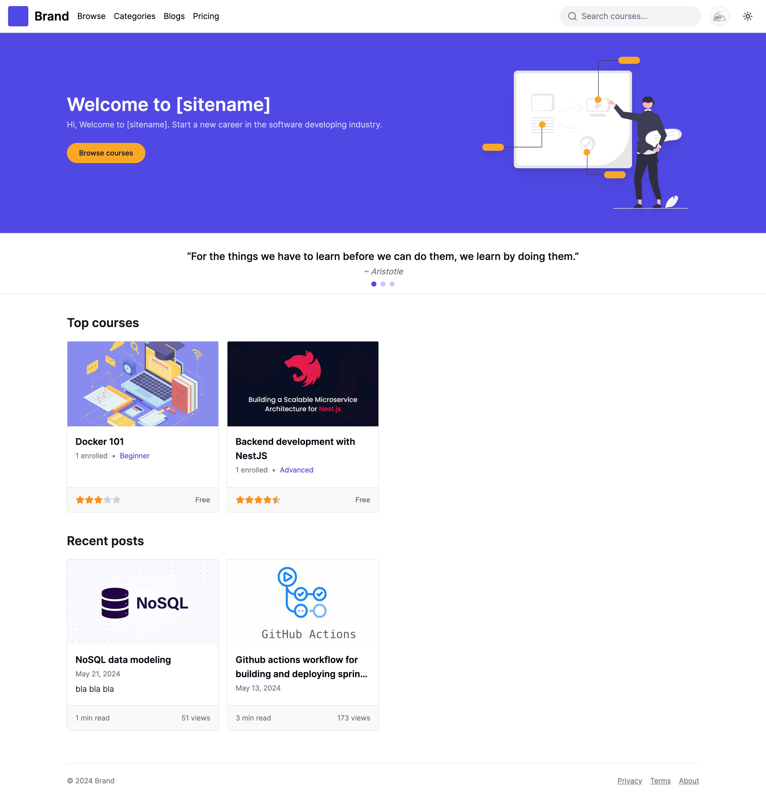
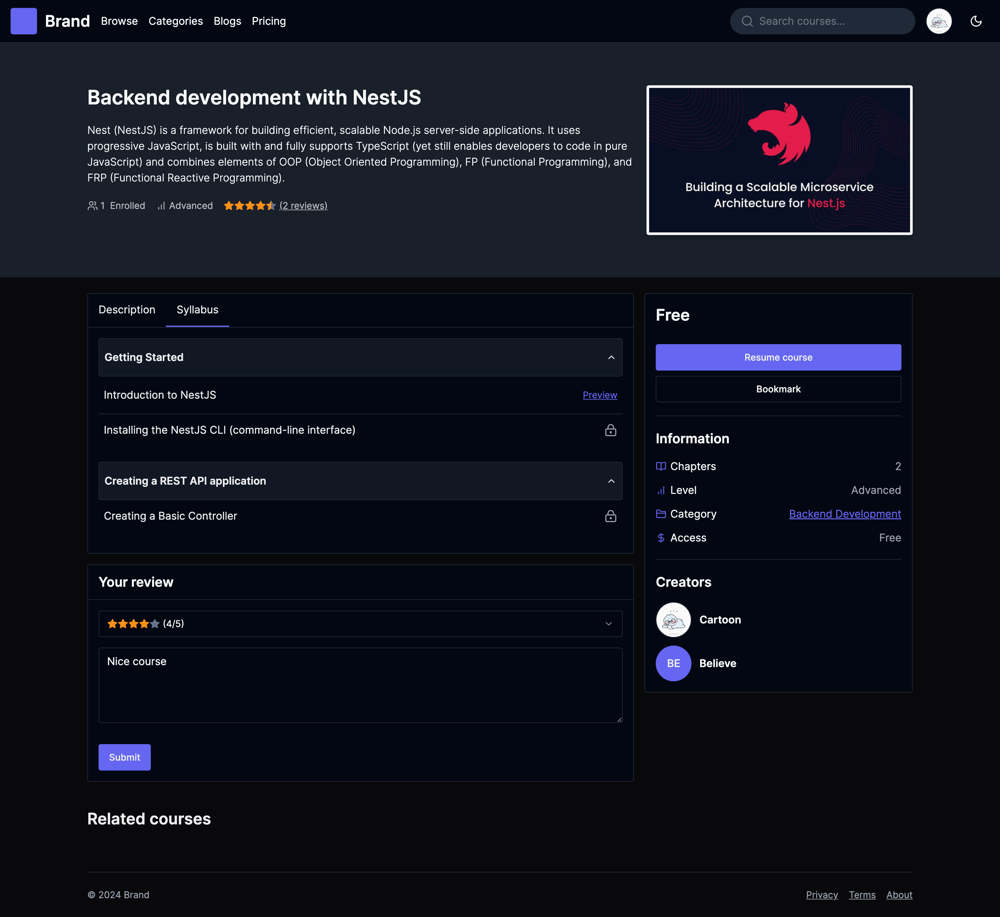
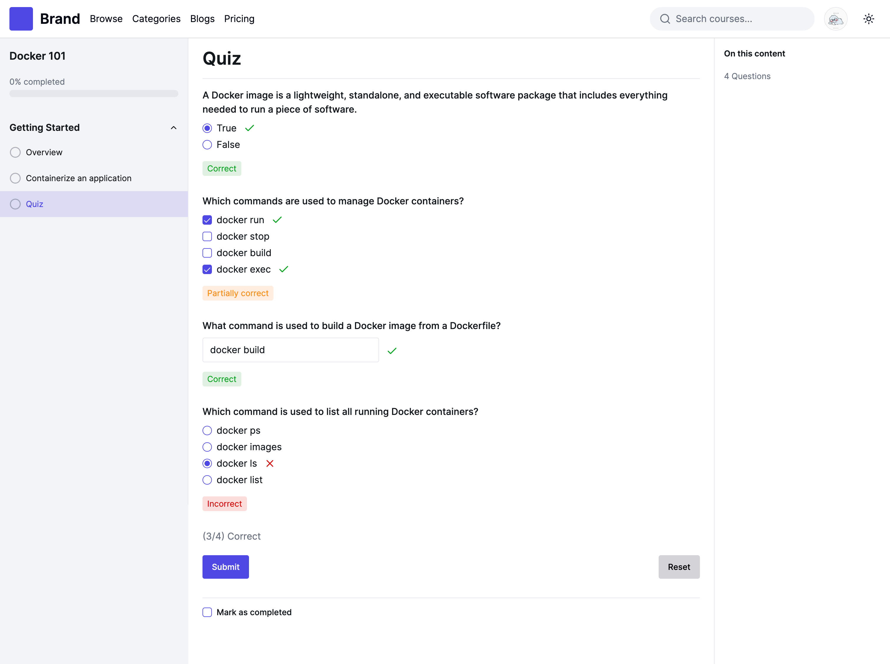
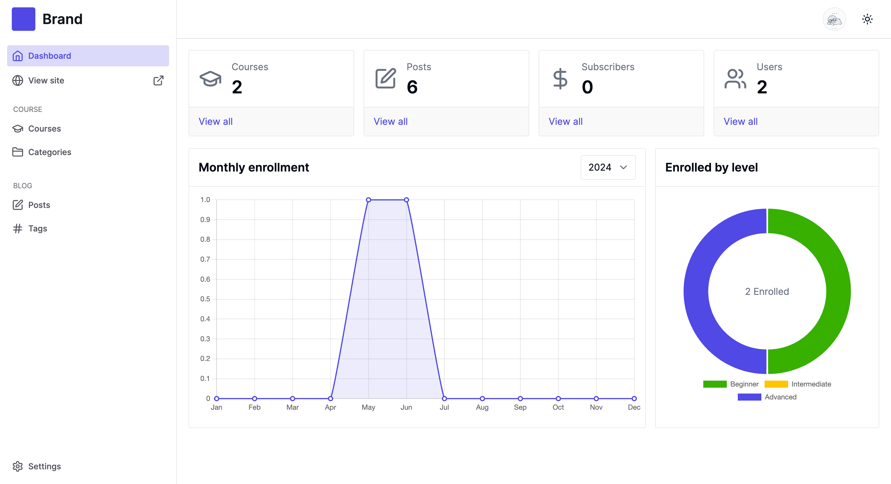
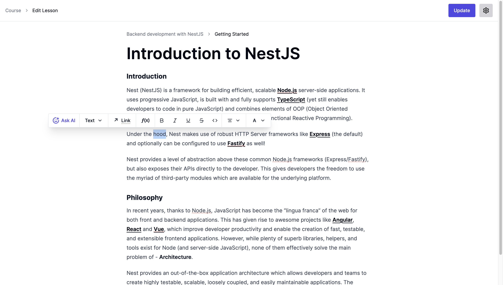
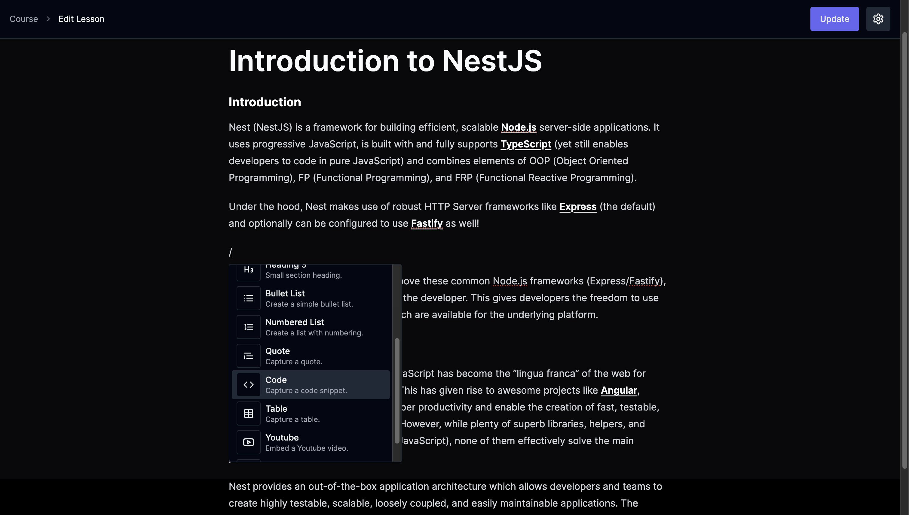
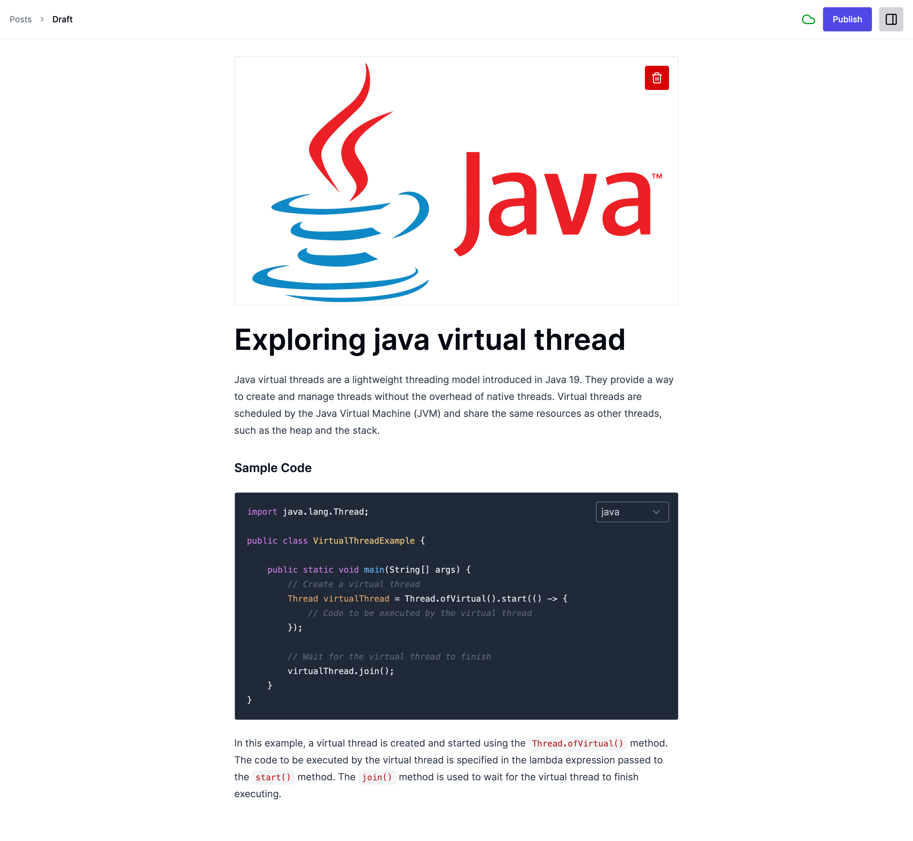

# E-learning backend

E-learning backend application project developed with [NestJS](https://nestjs.com/).

**Features**:
<ul>
	<li>- [x] Course Management</li>
	<li>- [x] Blog Management</li>
	<li>- [x] Quiz Management</li>
	<li>- [x] Category</li>
	<li>- [x] Tag</li>
	<li>- [x] Course Bookmark</li>
	<li>- [x] Course Review</li>
	<li>- [x] User Management</li>
	<li>- [x] AI powered content editor</li>
	<li>- [x] Dark mode support</li>
	<li>- [ ] Subscription</li>
</ul>

**Front-end website repository** => [E-learning website](https://github.com/phyohtetarkar/hope-elearning-web/)

**Mobile app repository** => [E-learning mobile](https://github.com/phyohtetarkar/hope-elearning-mobile/) (On going)

## Requirements
<ol>
	<li>Node.js 16 or later</li>
	<li>PostgreSQL 16 or later</li>
	<li>Firebase auth setup</li>
</ol>

## Installation and setup

**This project use Firebase auth as authentication layer. So, you first need to setup firebase auth and manually create one owner account. Or you can use any other authentication providers like AWS Cognito, Auth0 etc., and setup accordingly.**

Required `.env.local` file properties.

```ini
# database config
DB_NAME=
DB_HOST=
DB_PORT=
DB_USERNAME=
DB_PASSWORD=

FIREBASE_SERVICE_ACCOUNT=/path/to/firebase-serviceaccount.json
FIREBASE_API_KEY= # Firebase api key

JWK_SET_URI=https://www.googleapis.com/service_accounts/v1/jwk/securetoken%40system.gserviceaccount.com
ISSUER_URI=https://securetoken.google.com/<your-project-id>

# for storing uploaded image (e.g, /var/www/html/images)
IMAGE_PATH=<image-base-path> 

IMAGE_URL=(http|https)://<your-domain>/images

# for owner account
SUPER_USER_ID= # The one you created from firebase auth
SUPER_USER_NAME= # Your preferred name
```

Installing dependencies

```bash
$ npm install
```

## Running the app

```bash
# development
$ npm run start

# watch mode
$ npm run start:dev

# production mode
$ npm run start:prod
```

## Test

```bash
# unit tests
$ npm run test

# e2e tests
$ npm run test:e2e

# test coverage
$ npm run test:cov
```

## REST APIs

You can explore api docs via path `http://localhost:3080/api-docs`.

## Support me

<a href="https://www.buymeacoffee.com/yzox2vc1i">
	
</a>
<br/>
<br/>

## Screenshots















